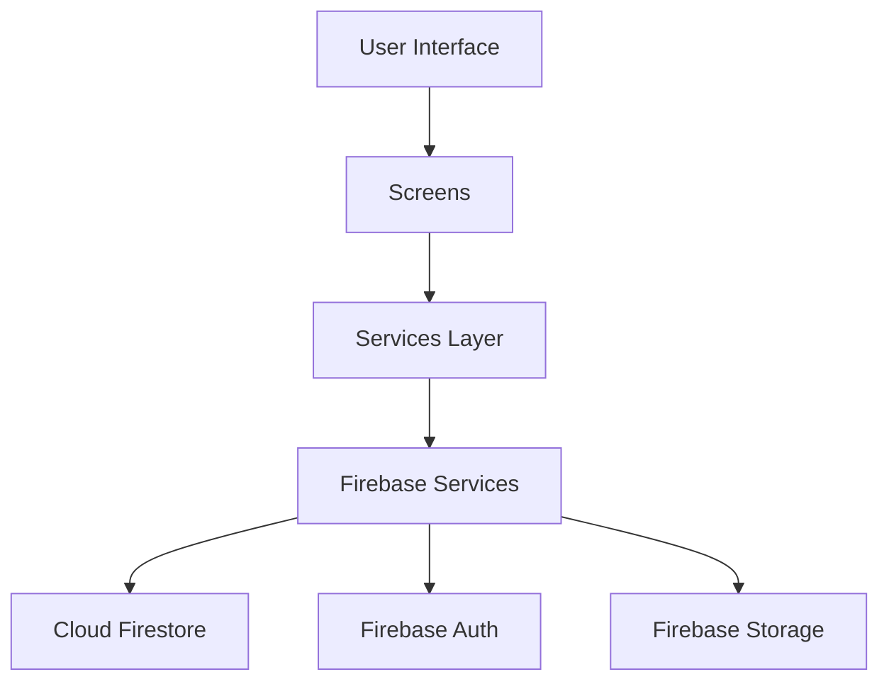

# Cinec Movie Booking App

A Flutter-based movie ticket booking application with Firebase backend integration.

## Features

- Browse latest movies with details and showtimes
- User authentication (Sign up/Sign in)
- Real-time seat selection and booking
- View booking history
- Multiple screens and showtimes support
- Admin features for managing showtimes

## Screenshots

[Add your app screenshots here]

## Architecture

### Tech Stack
- **Frontend**: Flutter
- **Backend**: Firebase
  - Authentication
  - Cloud Firestore
  - Storage (for movie posters)
- **State Management**: Stream-based reactivity with Firebase
- **Design Pattern**: Repository pattern for data layer

### Database Structure

```
collections/
├── movies/
│   └── {movieId}/
│       ├── title: string
│       ├── synopsis: string
│       ├── genre: string
│       ├── duration: number
│       ├── posterUrl: string
│       └── trailerUrl: string
├── showtimes/
│   └── {showtimeId}/
│       ├── movieId: string
│       ├── theater: string
│       ├── time: timestamp
│       ├── price: number
│       ├── totalSeats: number
│       └── bookedSeats: array
├── bookings/
│   └── {bookingId}/
│       ├── userId: reference
│       ├── showtimeRef: reference
│       ├── seats: array
│       ├── totalAmount: number
│       ├── bookingDate: timestamp
│       └── movieTitle: string
└── users/
    └── {userId}/
        ├── email: string
        └── name: string
```

## Installation

### Prerequisites
- Flutter SDK (3.0 or higher)
- Android Studio / VS Code with Flutter plugins
- Firebase project setup
- Git

### Setup Steps

1. Clone the repository
```bash
git clone https://github.com/yourusername/cinec_movie_app.git
cd cinec_movie_app
```

2. Install dependencies
```bash
flutter pub get
```

3. Firebase Setup
   - Create a new Firebase project at [Firebase Console](https://console.firebase.google.com)
   - Enable Authentication (Email/Password)
   - Enable Cloud Firestore
   - Enable Storage
   - Download `google-services.json` and place it in `android/app/`
   - Add your SHA-1 and SHA-256 certificates to Firebase project

4. Configure Firebase in the app
   - Update `lib/firebase_options.dart` with your Firebase configuration
   - Ensure Firestore rules are set appropriately

5. Run the app
```bash
flutter run
```

### Building Release APK

To generate a release APK:

```bash
flutter build apk --release
```

The APK will be available at: `build/app/outputs/flutter-apk/app-release.apk`

## Usage Guide

### User Flow

1. **Authentication**
   - Open the app
   - Sign up with email/password or sign in if existing user
   - Admin credentials (if needed): admin@cinec.com

2. **Booking Process**
   - Browse available movies on home screen
   - Select a movie to view details
   - Choose preferred showtime
   - Select seats
   - Confirm booking
   - View booking in history

3. **Admin Features**
   - Access admin panel (debug mode)
   - Manage showtimes
   - Edit movie details
   - View booking statistics

## Project Structure

```
lib/
├── main.dart
├── firebase_options.dart
├── models/
│   ├── movie.dart
│   ├── showtime.dart
│   ├── booking.dart
│   └── user.dart
├── screens/
│   ├── home_screen.dart
│   ├── movie_detail_screen.dart
│   ├── login_screen.dart
│   ├── register_screen.dart
│   ├── seat_selection_screen.dart
│   └── booking_history_screen.dart
├── services/
│   └── booking_service.dart
├── utils/
│   └── add_showtimes.dart
└── widgets/
    ├── movie_card.dart
    └── seat_selection_widget.dart
```

## Architecture Flow



## Error Handling

The app implements comprehensive error handling for:
- Network issues
- Authentication failures
- Booking conflicts
- Invalid seat selections
- Firebase operation failures

## Performance Considerations

- Lazy loading of movie posters
- Efficient Firestore queries
- Caching of frequently accessed data
- Optimized state management
- Minimal UI rebuilds

## Security

- Firebase Authentication
- Firestore Security Rules
- Data validation
- Secure file storage
- Protected admin routes

## Future Enhancements

- Payment gateway integration
- Push notifications
- Movie reviews and ratings
- Social sharing
- Offline support
- Multi-language support

## Contributing

1. Fork the repository
2. Create your feature branch (`git checkout -b feature/AmazingFeature`)
3. Commit your changes (`git commit -m 'Add some AmazingFeature'`)
4. Push to the branch (`git push origin feature/AmazingFeature`)
5. Open a Pull Request

## License

This project is licensed under the MIT License - see the LICENSE file for details.

## Contact

Your Name - your.email@example.com
Project Link: [https://github.com/yourusername/cinec_movie_app](https://github.com/yourusername/cinec_movie_app)

## Acknowledgments

- Flutter team for the amazing framework
- Firebase for backend services
- All contributors who helped with the project